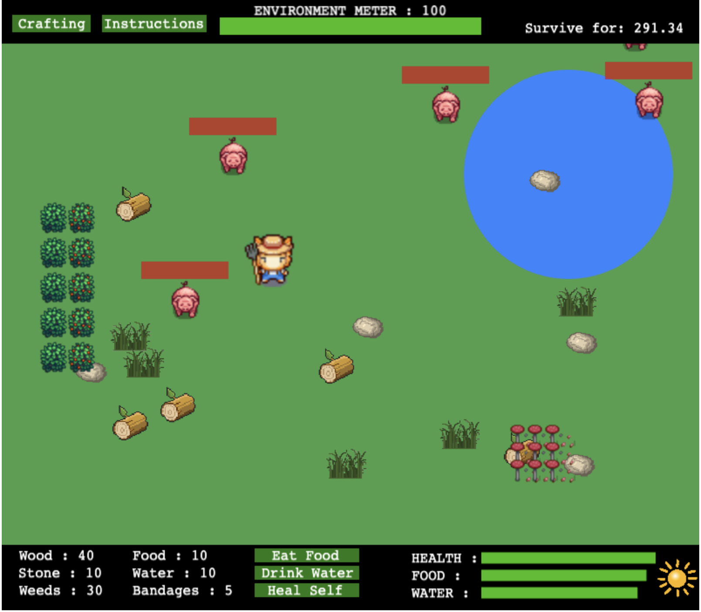
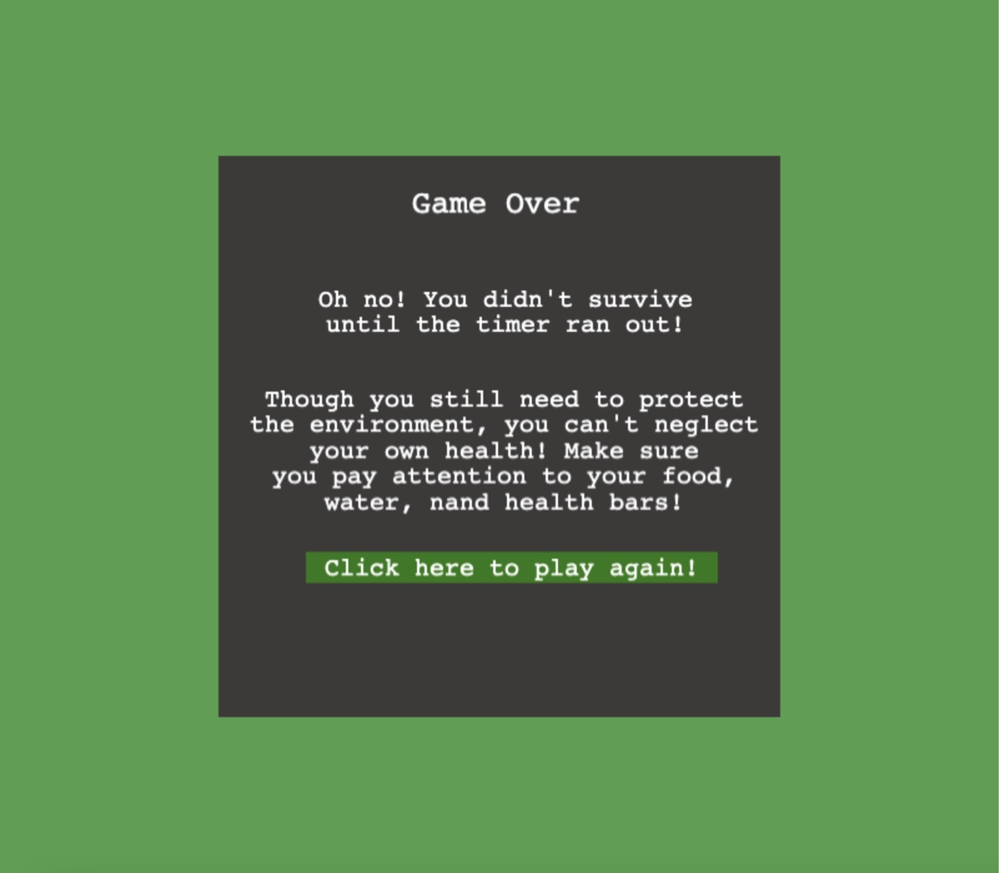

# Theory of Green MVP
##### Spring 2022 CISC374: Edu Game Dev, Prof. Pollock

### Team Members:
- [Trea Holley](https://github.com/TreaHolley)
- [Cameron Thacker](https://github.com/cthacker-udel)
- [Zoe Valladares](https://github.com/Pink-Hat-Hacker)
- [Allison Ziegler](https://github.com/allisonz316)

### Game Description
> Imagine popular games such as Minecraft and Fortnite, except tasks, getting materials, and surviving is just as important as being environmentally conscious and sustainable –– teaching children about being eco-friendly while having fun. 

### Game View
**Instructions**

**Starting Screen**

**Crafting Screen**

**Game Over Screen**

---
### Code

| Dependencies | Language | Image Resources | Sounds |
| -------------|----------|-----------------|--------|
| [Phaser Library](https://phaser.io/) | ☕️ JavaScript | [Spriters Resource](https://www.spriters-resource.com/) | [Video Game Music](https://downloads.khinsider.com/game-soundtracks/nintendo-ds)|

